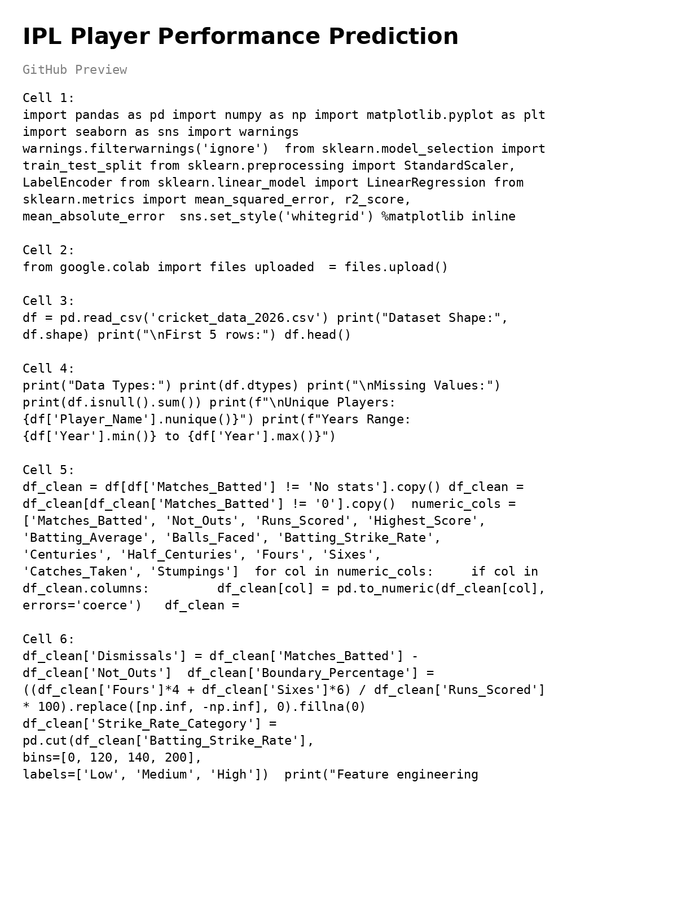

# 🏏 IPL Player Performance Analysis

A data analysis project built using **Python** and **Google Colab** to analyze IPL player performance. This project explores player statistics, identifies performance trends, and visualizes insights using real IPL data.

---

## 📌 Project Overview

The objective of this project is to analyze IPL player performance using a real-world cricket dataset. The notebook performs data cleaning, exploratory data analysis (EDA), and visualization to uncover meaningful insights from the data.

---

## 🚀 Features

- Data Cleaning and Preprocessing
- Exploratory Data Analysis (EDA)
- Player Performance Analysis
- Statistical Insights
- Data Visualization
- Trend Analysis

---

## 🛠️ Technologies Used

- Python
- Google Colab
- Pandas
- NumPy
- Matplotlib
- Seaborn
- Scikit-learn
> Add **Seaborn** or **Scikit-learn** only if your notebook actually uses them.

---

## 📂 Project Structure

```
IPL_Player_Performance/
│── IPL_Player_Performance.ipynb
│── cricket_data_2026.csv
│── README.md
│── requirements.txt
│── LICENSE
```

## 📸 Project Preview



---

## 📊 Dataset

- Dataset: `cricket_data_2026.csv`
- Format: CSV
- Contains IPL player performance statistics used for analysis.

---

## 📈 Project Workflow

1. Import Dataset
2. Clean and Prepare Data
3. Perform Exploratory Data Analysis
4. Create Visualizations
5. Analyze Player Performance
6. Draw Insights

---

## ▶️ How to Run

1. Clone this repository

```bash
git clone https://github.com/RajaSahu89/IPL_Player_Performance.git
```

2. Install required libraries

```bash
pip install -r requirements.txt
```

3. Open the notebook in Google Colab or Jupyter Notebook.

---

## 📸 Sample Output

Add screenshots of your charts and analysis here.

Example:

- Player Performance Chart
- Runs Distribution
- Top Players Analysis

---

## 🎯 Key Learning

- Data Cleaning
- Data Analysis
- Data Visualization
- Working with CSV datasets
- Python programming
- Google Colab workflow

---

## 👨‍💻 Author

**Raja Sahu**

- GitHub: https://github.com/RajaSahu89

---

## 📄 License

This project is licensed under the MIT License.
